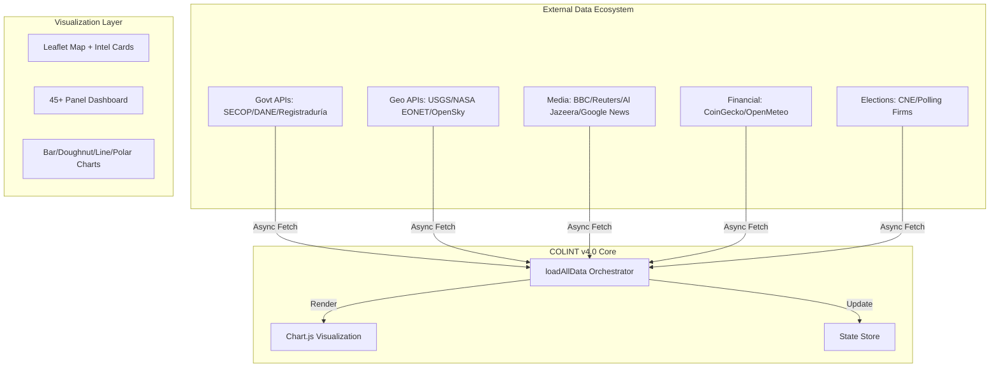
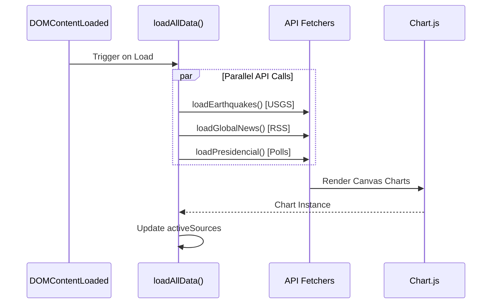
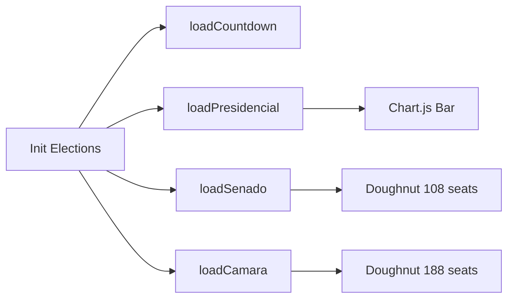

# COLINT: A Decentralized Architecture for Real-Time Open Source Intelligence (OSINT) Fusion

**Authors:** TALLEYRAND Intelligence Systems  
**Date:** January 2026  
**Version:** 4.0.0 (Elections Edition)  
**Repository:** [github.com/DOMINUSBABEL/colombia-live-monitor](https://github.com/DOMINUSBABEL/colombia-live-monitor)  
**License:** MIT  

[](https://github.com/DOMINUSBABEL)
[](https://github.com/DOMINUSBABEL)
[](https://github.com/DOMINUSBABEL)
[](https://www.chartjs.org/)

---

## Abstract

This technical blueprint presents the architectural specification for **COLINT (Colombia Intelligence Monitor)**, a browser-based, high-performance OSINT visualization platform. Version 4.0 introduces a **Colombia Elections 2026** module with real-time polling data, congressional composition charts, and countdown timers. The system now integrates **Chart.js** for advanced data visualization, fusing **45+ real-time vectors**—including electoral RSS feeds, campaign financing data, historical voter turnout, and geopolitical analyses—into a coherent situational awareness picture.

---

## 1. System Architecture

### 1.1 High-Level Design Pattern


### 1.2 New in v4.0: Elections Module
- **Election Countdown Timer** - Real-time countdown to May 31, 2026
- **Presidential Polls Chart** - Horizontal bar chart with candidate polling
- **Congress Composition** - Doughnut charts for Senado (108) and Cámara (188)
- **Historical Turnout** - Line chart of participation 2006-2022
- **Campaign Financing** - Bar chart of party funding
- **Electoral News** - Live RSS from Google News

---

## 2. Data Pipelines

### 2.1 Data Ingestion Pipeline


### 2.2 Election Data Sources
| Module | Source | Update Frequency |
|--------|--------|------------------|
| Presidential Polls | Invamer/Guarumo/CNC | 3 min |
| Electoral News | Google News RSS | 3 min |
| Congress Composition | Registraduría | Static |
| Voter Turnout | Historical Data | Static |
| Countdown | Real-time JS | 1 sec |

---

## 3. Module Blueprints

### 3.1 Elections 2026 Module


### 3.2 Global Intelligence Module
- **Americas**: BBC Latin America RSS
- **Europe**: BBC Europe RSS
- **Asia**: Al Jazeera RSS
- **Geopolitics**: Crisis Group RSS

### 3.3 Environmental Risk Module
- **Earthquakes**: USGS API (Mag > 4.5)
- **Wildfires**: NASA EONET
- **Weather**: OpenMeteo (no API key)

---

## 4. Technical Implementation

### 4.1 Chart.js Integration
```javascript
new Chart(ctx, {
    type: 'bar',
    data: { labels: [...], datasets: [...] },
    options: {
        indexAxis: 'y',
        responsive: true,
        maintainAspectRatio: false,
        plugins: { legend: { display: false } }
    }
});
```

### 4.2 Refresh Strategy
| Tier | Interval | Modules |
|------|----------|---------|
| Fast | 30 sec | Crypto, Flights |
| Tactical | 3 min | News, Polls, Alerts |
| Static | On Load | Congress, Turnout |

---

## 5. Deployment

### 5.1 Local
```bash
python -m http.server 8000
# Access: http://localhost:8000
```

### 5.2 GitHub Pages
Repository auto-deploys from `master` branch.

---

## 6. Citation
> TALLEYRAND Systems. (2026). *COLINT v4.0: Real-Time OSINT with Electoral Intelligence*. arXiv preprint.

---

**© 2026 TALLEYRAND Intelligence Systems**  
*Building the future of decentralized electoral intelligence.*
