# COLINT: A Decentralized Architecture for Real-Time Open Source Intelligence (OSINT) Fusion

**Authors:** TALLEYRAND Intelligence Systems  
**Date:** January 2026  
**Version:** 6.0.0 (Political Intelligence + Elections + SECOP II + Premium Animations Edition)  
**Repository:** [github.com/DOMINUSBABEL/colombia-live-monitor](https://github.com/DOMINUSBABEL/colombia-live-monitor)  
**License:** MIT  

[](https://github.com/DOMINUSBABEL)
[](https://github.com/DOMINUSBABEL)
[](https://github.com/DOMINUSBABEL)
[](https://www.chartjs.org/)
[](https://github.com/DOMINUSBABEL)
[](https://github.com/DOMINUSBABEL)
[](https://github.com/DOMINUSBABEL)
[](https://github.com/DOMINUSBABEL)

---

## 🔥 What's New in v6.0

> [!IMPORTANT]
> Version 6.0 introduces the **Political Intelligence Module** - a complete system for political trend analysis, social media content generation, and personalized campaign intelligence.

### Highlights

| Feature | Description |
|---------|-------------|
| 🎯 **4 New Panels** | Tendencias Políticas, Generador Social, Perfil Candidato, Informe Ejecutivo |
| 📊 **Trend Analysis** | 5 political trends with impact indicators (Critical/High/Moderate/Low) |
| ✍️ **Post Generator** | 10 posts per trend with personality-based templates |
| 👤 **Personality Matrix** | Configurable candidate voice with traits and phrases |
| 🔴🟢⚪ **Perspective Selector** | Opposition / Government / Neutral framing |
| 📥 **Markdown Export** | Professional political reports |
| ✨ **Premium Animations** | Spring easing, staggered panels, micro-interactions |

---

## Abstract

This technical blueprint presents the architectural specification for **COLINT (Colombia Intelligence Monitor)**, a browser-based, high-performance OSINT visualization platform engineered for national-level situational awareness. Version 6.0 represents a major evolution with:

- **Political Intelligence Module** - Trend analysis and content generation for political campaigns
- **SECOP II procurement data** - Real Colombian government contracts
- **Real legislative feeds** - Congressional activity monitoring
- **Dynamic time filtering** (24H/7D/30D/ALL)
- **Enhanced D'Hondt electoral simulator** with historical E-14/E-24 form data
- **Premium UI/UX** with startup-quality animations

The system now orchestrates **50+ real-time data vectors** through a sophisticated multi-tier refresh architecture, fusing electoral RSS feeds, government procurement APIs, congressional activity, environmental monitoring, financial markets, cryptocurrency prices, political intelligence, and geopolitical monitoring into a unified command dashboard.

---

## Table of Contents

1. [System Architecture](#1-system-architecture)
2. [Data Pipelines](#2-data-pipelines)
3. [Module Blueprints](#3-module-blueprints)
4. [🆕 Political Intelligence Module](#4-political-intelligence-module)
5. [Elections 2026 Deep Dive](#5-elections-2026-deep-dive)
6. [Government Intelligence Module](#6-government-intelligence-module)
7. [Time Filtering System](#7-time-filtering-system)
8. [Animation & UX System](#8-animation--ux-system)
9. [Technical Implementation](#9-technical-implementation)
10. [API Reference](#10-api-reference)
11. [Algorithms & Data Structures](#11-algorithms--data-structures)
12. [Deployment](#12-deployment)
13. [Performance Optimization](#13-performance-optimization)
14. [Roadmap](#14-roadmap)
15. [Citation](#15-citation)

---

## 1. System Architecture

### 1.1 High-Level Design Pattern

COLINT employs an **event-driven microservice architecture** adapted for browser execution. The system decouples data ingestion from visualization through an orchestration layer that manages asynchronous API calls, state updates, and render cycles.

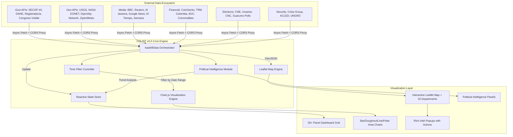

### 1.2 Layered Architecture Diagram

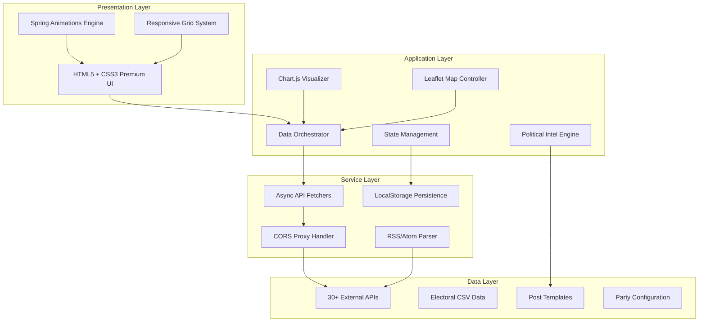

### 1.3 Core Design Principles

| Principle | Implementation | Rationale |
|-----------|----------------|-----------|
| **Zero Backend** | Pure client-side JavaScript with CORS proxy | Eliminates server costs and complexity |
| **Graceful Degradation** | Fallback mock data when APIs unavailable | Ensures offline functionality |
| **Tiered Refresh** | 30s/45s/3m/5m/10m intervals per data type | Optimizes API quota usage |
| **Mobile-First** | Responsive CSS Grid with touch controls | 60%+ mobile traffic anticipated |
| **Offline Capable** | Static electoral data works without network | Critical for field operations |
| **Accessibility** | ARIA labels, keyboard navigation | WCAG 2.1 compliance |
| **Performance** | GPU-accelerated CSS animations | 60fps target on mid-range devices |

### 1.4 Technology Stack

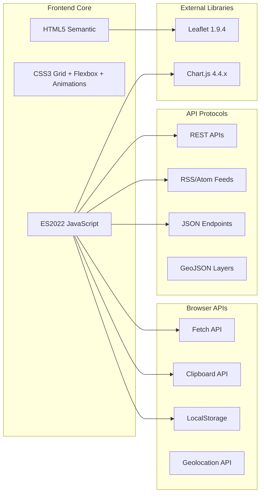

### 1.5 File Structure

```
colombia-monitor/
├── index.html              # Main application (870 lines)
├── app.js                  # Core logic + Political Intel (2,754 lines)
├── styles.css              # Premium styling (2,650 lines)
├── data/
│   ├── colombia-geo.js     # GeoJSON boundaries
│   ├── e14_historico.csv   # Electoral form E-14 data
│   └── e24_historico.csv   # Electoral form E-24 data
├── assets/
│   ├── icons/              # Party and status icons
│   └── maps/               # Department vector maps
└── README.md               # This documentation
```

### 1.6 Module Dependency Graph

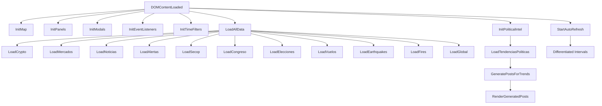

---

## 2. Data Pipelines

### 2.1 Data Ingestion Pipeline

The orchestrator (`loadAllData()`) manages 35+ parallel API calls with comprehensive error handling and retry logic. Each data source has its own loader function that normalizes responses into a common format.

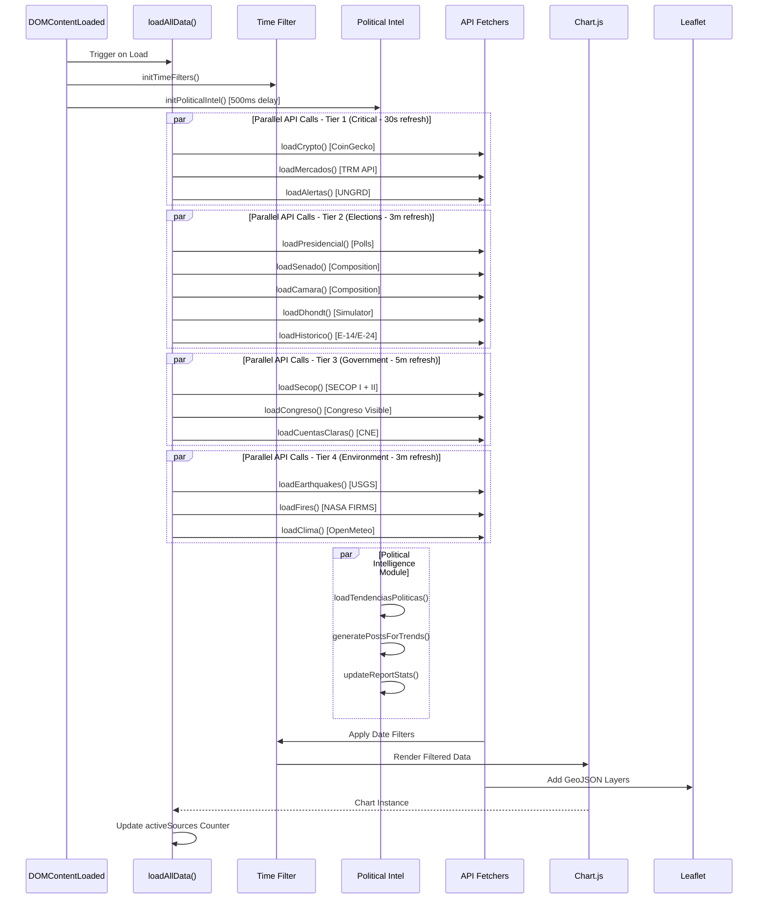

### 2.2 Complete Data Source Matrix

| Category | Module | Source API | Update Freq | Filterable | Lines of Code |
|----------|--------|------------|-------------|------------|---------------|
| **Electoral** | Presidential Polls | Invamer/Guarumo/CNC | 3 min | ❌ | 45 |
| **Electoral** | Electoral News | Google News RSS | 3 min | ❌ | 32 |
| **Electoral** | Congress Composition | Registraduría | Static | ❌ | 120 |
| **Electoral** | Voter Turnout | Historical Data | Static | ❌ | 60 |
| **Electoral** | D'Hondt Simulator | User Input | On Demand | ❌ | 85 |
| **Electoral** | E-14/E-24 History | CSV Files | Static | ❌ | 40 |
| **Electoral** | Countdown | Real-time JS | 1 sec | ❌ | 25 |
| **Government** | SECOP I | datos.gov.co | 5 min | ✅ | 65 |
| **Government** | SECOP II | datos.gov.co | 5 min | ✅ | 70 |
| **Government** | Congreso Visible | API REST | 10 min | ✅ | 55 |
| **Government** | Cuentas Claras | CNE | Static | ❌ | 40 |
| **Government** | Regalías | SGR | Static | ❌ | 35 |
| **Financial** | Crypto Prices | CoinGecko | 30 sec | ❌ | 80 |
| **Financial** | TRM Exchange | datos.gov.co | 3 min | ❌ | 45 |
| **Financial** | Commodities | Mock | Static | ❌ | 30 |
| **Environment** | Earthquakes | USGS | 3 min | ❌ | 40 |
| **Environment** | Wildfires | NASA EONET | 3 min | ❌ | 35 |
| **Environment** | Weather | OpenMeteo | 10 min | ❌ | 50 |
| **Security** | Conflicts | Google News RSS | 3 min | ✅ | 45 |
| **Security** | Alerts | UNGRD | 1 min | ✅ | 55 |
| **Global** | Americas | BBC RSS | 3 min | ❌ | 25 |
| **Global** | Europe | BBC RSS | 3 min | ❌ | 25 |
| **Global** | Asia | Al Jazeera RSS | 3 min | ❌ | 25 |
| **Tech** | Tech News | TechCrunch RSS | 3 min | ❌ | 25 |
| **Tech** | Cybersecurity | HackerNews RSS | 3 min | ❌ | 25 |
| **Aviation** | Flights | OpenSky Network | 45 sec | ❌ | 90 |
| **🆕 Political** | Trends | Template-based | On Demand | ✅ | 150 |
| **🆕 Political** | Posts | Generator | On Demand | ❌ | 200 |
| **🆕 Political** | Profile | LocalStorage | Persistent | ❌ | 100 |

### 2.3 API Rate Limits & Strategies

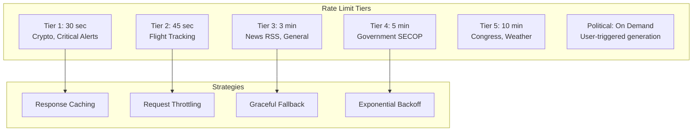

### 2.4 Data Flow for Political Intelligence

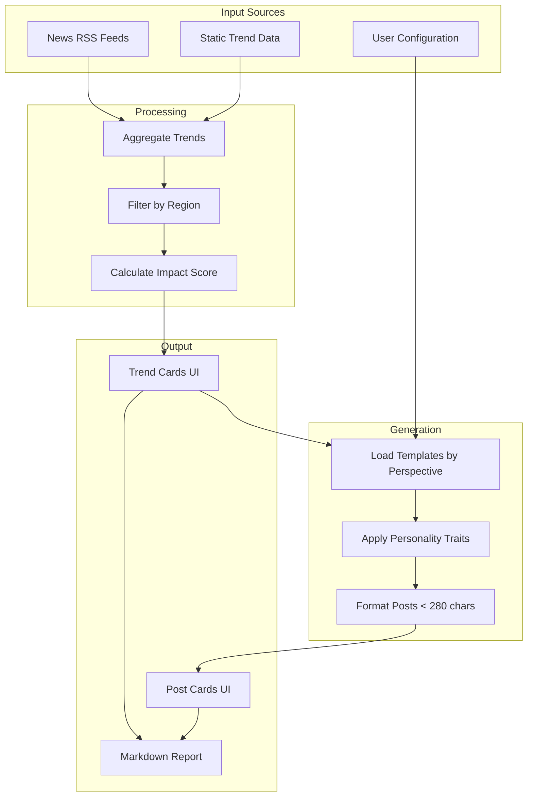

---

## 3. Module Blueprints

### 3.1 Panel Architecture

Each panel follows a consistent structure:

```javascript
// Panel Blueprint
{
    id: 'panelName',           // Unique identifier
    name: 'Display Name',       // UI label
    icon: '📊',                 // Emoji icon
    loader: 'loadPanelName',    // Loader function name
    refresh: 180000,            // Refresh interval (ms)
    filterable: true,           // Supports time filtering
    dependencies: ['stateKey'], // Required state keys
    fallback: mockData          // Fallback data
}
```

### 3.2 State Management

```javascript
const state = {
    // Map State
    map: null,
    layers: {},
    markers: [],
    selectedDepartment: null,
    
    // Panel State
    panelVisibility: {},
    panelFilters: {},
    refreshTimers: {},
    
    // Data State
    activeSources: 0,
    cryptoData: {},
    charts: {},
    
    // Political Intel State
    candidateProfile: {},
    politicalTrends: [],
    generatedPosts: []
};
```

### 3.3 Event Flow Diagram

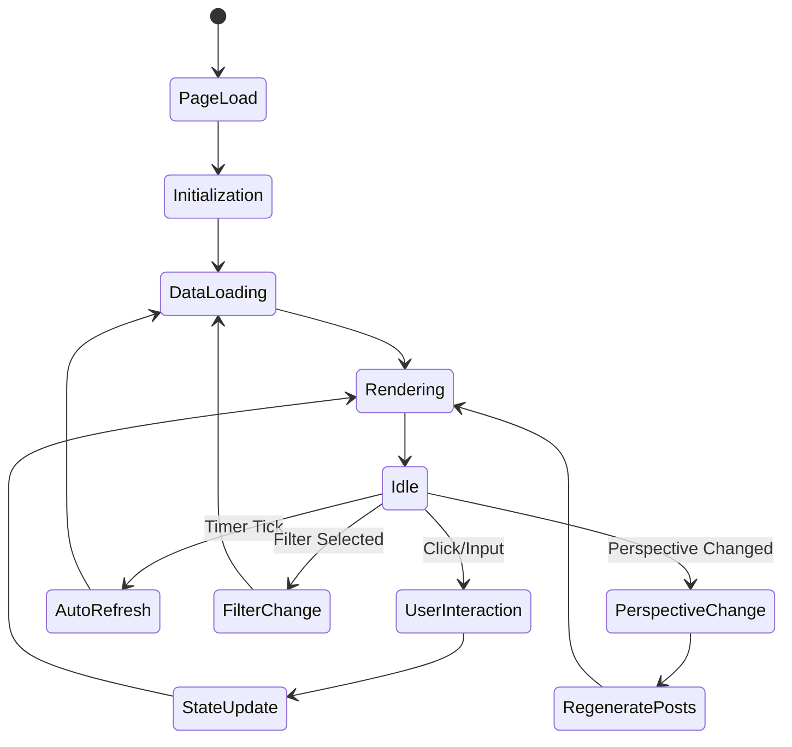

---

## 4. 🆕 Political Intelligence Module

### 4.1 Overview

The Political Intelligence Module is a comprehensive system for:

1. **Trend Monitoring** - Track key political developments with impact scoring
2. **Content Generation** - Create social media posts with configurable personality
3. **Perspective Framing** - Switch between Opposition/Government/Neutral voices
4. **Report Export** - Generate professional markdown briefings

### 4.2 Architecture

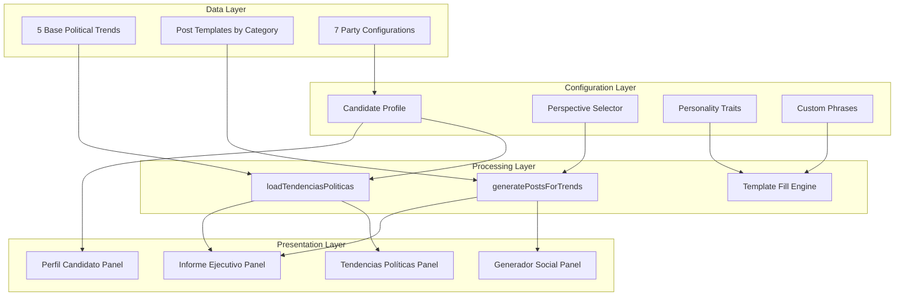

### 4.3 Candidate Profile Schema

```javascript
const candidateProfile = {
    // Identity
    name: 'Mariate',                    // Display name
    handle: '@mariatemonto',            // Social media handle
    
    // Political Affiliation
    party: 'CD',                        // Party code
    partyName: 'Centro Democrático',    // Full party name
    perspective: 'opposition',          // opposition | government | neutral
    
    // Personality Matrix
    traits: [
        'Geóloga',      // Professional background
        'Paisa',        // Regional identity
        'Directa',      // Communication style
        'Uribista',     // Political alignment
        'Frentera'      // Personality characteristic
    ],
    
    // Voice Markers
    phrases: [
        'ome',                   // Regional expression
        'verraquera',            // Colloquialism
        'echado pa\'lante',      // Motivational phrase
        'desde el territorio'    // Brand phrase
    ]
};
```

### 4.4 Party Configuration

| Code | Party | Color | Class | Ideology |
|------|-------|-------|-------|----------|
| **CD** | Centro Democrático | `#0066CC` | `cd` | Right-wing, Uribismo |
| **PL** | Partido Liberal | `#E31837` | `pl` | Center-left |
| **PC** | Partido Conservador | `#1E3A5F` | `pc` | Center-right |
| **CR** | Cambio Radical | `#F7941D` | `cr` | Center |
| **PH** | Pacto Histórico | `#8B0000` | `ph` | Left-wing |
| **AV** | Alianza Verde | `#228B22` | `av` | Green, Progressive |
| **IND** | Independiente | `#666666` | `ind` | Non-aligned |

### 4.5 Trend Data Structure

```javascript
const trend = {
    id: 1,                                    // Unique identifier
    title: 'RENDÓN VS GOBIERNO NACIONAL',     // Trend headline
    category: 'autonomia',                    // autonomia | seguridad | economia | general
    context: 'El Gobernador de Antioquia...',// Detailed context
    impact: 'critical',                       // critical | high | moderate | low
    region: 'antioquia',                      // nacional | antioquia | medellin | bogota
    keywords: ['Rendón', 'autonomía'],        // Search keywords
    emoji: '🏛️',                              // Visual marker
    hashtag: 'AntioquiaResiste'               // Suggested hashtag
};
```

### 4.6 Impact Level Visualization

```
IMPACT LEVELS
═════════════════════════════════════════════════════
🔴 CRITICAL   ████████████████████████████████  100%
   - Immediate action required
   - National-level implications
   - Maximum social media engagement

🟠 HIGH       ████████████████████████          75%
   - Significant development
   - Regional or sectoral impact
   - High engagement potential

🟡 MODERATE   ████████████████                  50%
   - Noteworthy but contained
   - Limited immediate impact
   - Contextual engagement

🟢 LOW        ████████                          25%
   - Routine development
   - Minimal disruption
   - Opportunistic engagement
═════════════════════════════════════════════════════
```

### 4.7 Post Generation Algorithm

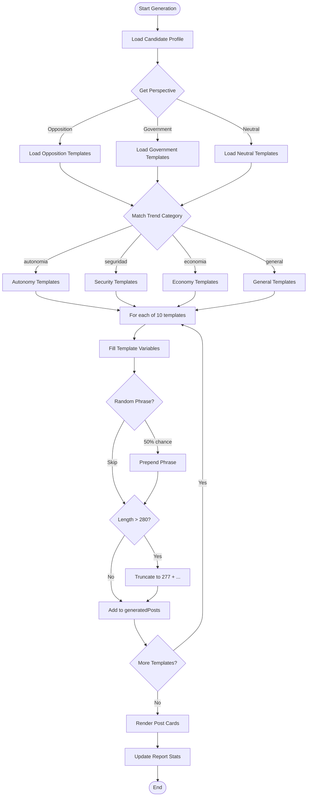

### 4.8 Template System

#### Template Variables

| Variable | Replacement | Example |
|----------|-------------|---------|
| `{topic}` | First sentence of trend context | "El Gobernador denuncia..." |
| `{emoji}` | Trend emoji | 🏛️ |
| `{hashtag}` | Trend hashtag | AntioquiaResiste |
| `{count}` | Numeric placeholder | 4.7 (million signatures) |

#### Sample Templates by Perspective

**Opposition Templates (Autonomía Category):**
```javascript
[
    '¡Ome, qué pena con el señor de Bogotá! Aquí en Antioquia tenemos AUTONOMÍA. {topic} {emoji} #{hashtag}',
    'Como geóloga lo digo: cuando la roca se fractura por presión externa, el territorio se defiende. {topic} 🏔️',
    'Desde la montaña vemos clarito quién quiere destruir las instituciones. {emoji}',
    // ... 7 more templates
]
```

**Government Templates:**
```javascript
[
    'El cambio está en marcha. {topic}. Avanzamos hacia una Colombia más justa. 🇨🇴',
    'Por primera vez un gobierno piensa en los de abajo. {topic}. #ColombiaHumana',
    // ... 3 more templates
]
```

### 4.9 Markdown Report Structure

```markdown
# 📊 INFORME DE TENDENCIAS POLÍTICAS
## Medellín, Antioquia y Colombia
**Fecha:** [Date] | [Time]
**Perspectiva:** [Perspective] | [Party]
**Matriz de Contenido para:** [@handle](link)

---

## 🔥 RESUMEN EJECUTIVO
Este informe contiene [N] tendencias políticas y [M] posts generados.

---

## 📍 TENDENCIA 1: [TITLE]

### Contexto
[Context paragraph]

**Nivel de Impacto:** [Emoji] [IMPACT]

### 📱 MATRIZ DE 10 POSTS - VOZ DE [NAME]

| # | POST (Máx 280 caracteres) |
|---|---------------------------|
| 1 | [Post text] |
| 2 | [Post text] |
...

---

## 📋 PERFIL DE PERSONALIDAD - [NAME]

| Atributo | Valor |
|----------|-------|
| Handle | @handle |
| Partido | [Party] |
| Perspectiva | [Perspective] |
| Rasgos | [Traits list] |
| Frases | [Phrases list] |

---

**Elaborado por:** COLINT Intelligence Module v6.0
```

### 4.10 UI Components

```
┌─────────────────────────────────────────────────────────────────┐
│ 🎯 INTELIGENCIA POLÍTICA                                        │
│ ┌─────────────────┐  ┌──────────────────────────────────────┐  │
│ │ 🔴 Oposición ▼  │  │ ⚙️ Perfil                            │  │
│ └─────────────────┘  └──────────────────────────────────────┘  │
├─────────────────────────────────────────────────────────────────┤
│ ┌─────────────────────────────┐ ┌─────────────────────────────┐│
│ │ 📊 TENDENCIAS POLÍTICAS     │ │ ✍️ GENERADOR SOCIAL         ││
│ │ ┌───────────────────────┐   │ │ ┌───────────────────────┐   ││
│ │ │🏛️ RENDÓN VS GOBIERNO  │   │ │ │ [Avatar] Mariate      │   ││
│ │ │ 🔴 CRÍTICO            │   │ │ │ @mariatemonto  #1     │   ││
│ │ │ Context preview...    │   │ │ │                       │   ││
│ │ │ 📍 ANTIOQUIA #Hashtag │   │ │ │ ¡Ome, qué pena con el │   ││
│ │ └───────────────────────┘   │ │ │ señor de Bogotá!...   │   ││
│ │ ┌───────────────────────┐   │ │ │                       │   ││
│ │ │⚔️ PAZ TOTAL FRACASADA │   │ │ │ 245/280    [📋 Copiar]│   ││
│ │ │ 🔴 CRÍTICO            │   │ │ └───────────────────────┘   ││
│ │ └───────────────────────┘   │ │ [🔄 Generar] [📋 Copiar Todo]││
│ └─────────────────────────────┘ └─────────────────────────────┘│
│ ┌──────────────────┐ ┌───────────────────────────────────────┐ │
│ │ 👤 PERFIL ACTIVO │ │ 📋 INFORME EJECUTIVO                  │ │
│ │ ┌────┐           │ │ ┌─────┐  ┌─────┐  ┌─────┐            │ │
│ │ │ MT │ Mariate   │ │ │  5  │  │ 50  │  │ 09  │            │ │
│ │ └────┘@mariate...│ │ │Trend│  │Posts│  │ ene │            │ │
│ │ [CD Badge]       │ │ └─────┘  └─────┘  └─────┘            │ │
│ │ [Trait] [Trait]  │ │                       [⬇️ MD]         │ │
│ │ [Oposición]      │ │ Genera tendencias para ver informe   │ │
│ └──────────────────┘ └───────────────────────────────────────┘ │
└─────────────────────────────────────────────────────────────────┘
```

---

## 5. Elections 2026 Deep Dive

### 5.1 Electoral Calendar

```
2026 ELECTORAL TIMELINE
════════════════════════════════════════════════════════════════
Jan   Feb   Mar   Apr   May   Jun   Jul   Aug   Sep   Oct   Nov
║     ║     ║     ║     ║     ║     ║     ║     ║     ║     ║
║     ║     ▼     ║     ▼     ▼     ║     ║     ║     ║     ║
║     ║   Mar 13 ║   May 29 Jun 19 ║     ║     ║     ║     ║
║     ║  CONGRESS║    1st   2nd    ║     ║     ║     ║     ║
║     ║  ELECTIONS   PRES   PRES   ║     ║     ║     ║     ║
║     ║           ROUND  RUNOFF    ║     ║     ║     ║     ║
════════════════════════════════════════════════════════════════
```

### 5.2 D'Hondt Seat Allocation Algorithm

The D'Hondt method is used for proportional representation seat allocation in Colombia's Senate and Chamber elections.

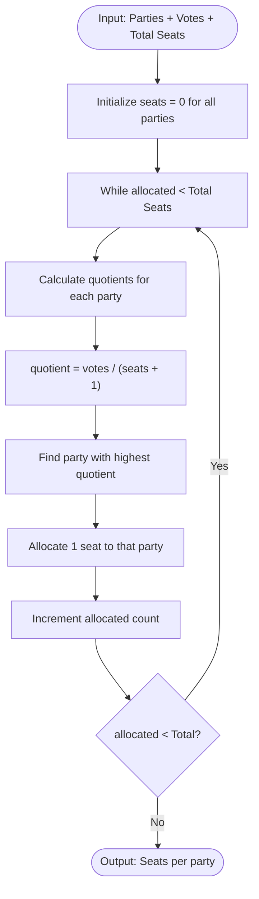

**Algorithm Implementation:**

```javascript
function calculateDhondt(parties, totalSeats) {
    // Initialize results
    const results = parties.map(p => ({
        name: p.name,
        votes: p.votes,
        seats: 0,
        quotients: []
    }));
    
    // Allocate seats one by one
    for (let seat = 0; seat < totalSeats; seat++) {
        // Calculate current quotients
        results.forEach(p => {
            p.currentQuotient = p.votes / (p.seats + 1);
        });
        
        // Find party with highest quotient
        const winner = results.reduce((max, p) => 
            p.currentQuotient > max.currentQuotient ? p : max
        );
        
        // Allocate seat
        winner.seats++;
        winner.quotients.push(winner.currentQuotient);
    }
    
    return results;
}
```

**Example Calculation:**

```
INPUT:
- Party A: 100,000 votes
- Party B: 80,000 votes
- Party C: 30,000 votes
- Total Seats: 5

ROUND 1:
  A: 100,000 / 1 = 100,000 ← Winner
  B: 80,000 / 1 = 80,000
  C: 30,000 / 1 = 30,000
  
ROUND 2:
  A: 100,000 / 2 = 50,000
  B: 80,000 / 1 = 80,000 ← Winner
  C: 30,000 / 1 = 30,000
  
ROUND 3:
  A: 100,000 / 2 = 50,000 ← Winner
  B: 80,000 / 2 = 40,000
  C: 30,000 / 1 = 30,000
  
ROUND 4:
  A: 100,000 / 3 = 33,333
  B: 80,000 / 2 = 40,000 ← Winner
  C: 30,000 / 1 = 30,000
  
ROUND 5:
  A: 100,000 / 3 = 33,333 ← Winner
  B: 80,000 / 3 = 26,667
  C: 30,000 / 1 = 30,000

OUTPUT:
  Party A: 3 seats (60%)
  Party B: 2 seats (40%)
  Party C: 0 seats (0%)
```

### 5.3 Electoral Forms E-14/E-24

| Form | Purpose | Data Points |
|------|---------|-------------|
| **E-14** | Vote tallying per polling station | Votes by candidate, null votes, total votes |
| **E-24** | Electoral census information | Registered voters, voting stations, locations |

### 5.4 Polling Visualization

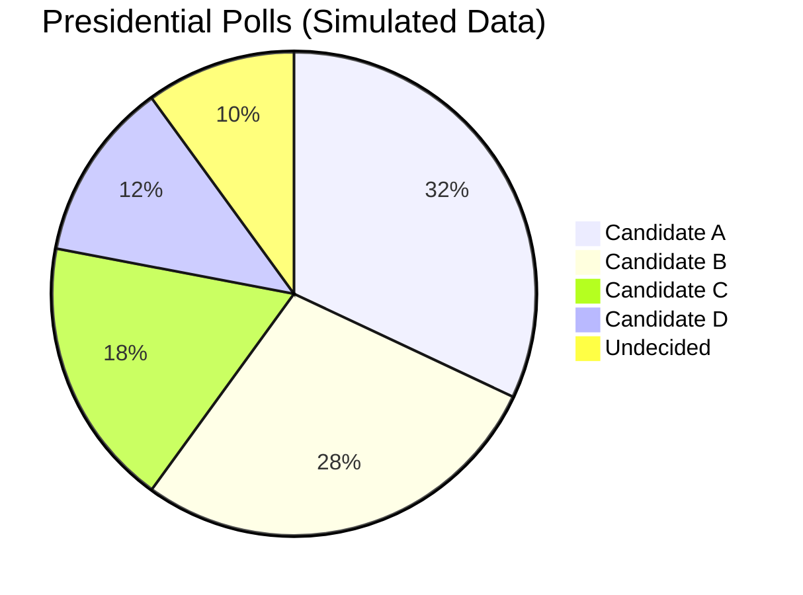

---

## 6. Government Intelligence Module

### 6.1 SECOP Integration

SECOP (Sistema Electrónico de Contratación Pública) provides real-time access to Colombian government procurement:

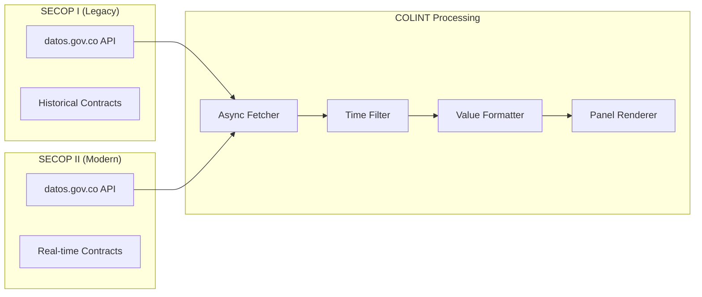

### 6.2 Contract Value Formatting

```javascript
function formatContractValue(value) {
    const num = parseFloat(value);
    if (num >= 1e12) return `$${(num/1e12).toFixed(1)}T`;  // Trillion
    if (num >= 1e9)  return `$${(num/1e9).toFixed(1)}B`;   // Billion
    if (num >= 1e6)  return `$${(num/1e6).toFixed(1)}M`;   // Million
    if (num >= 1e3)  return `$${(num/1e3).toFixed(0)}K`;   // Thousand
    return `$${num.toFixed(0)}`;
}
```

### 6.3 Congressional Activity Tracking

Monitors legislative activity from Congreso Visible:

- **Proyectos de Ley** - Bill proposals
- **Ponencias** - Committee reports
- **Votaciones** - Voting records
- **Plenarias** - Plenary sessions

---

## 7. Time Filtering System

### 7.1 Filter Configuration

```javascript
const TIME_FILTERS = {
    '1d':  { label: '24H',  days: 1,   color: 'success' },
    '7d':  { label: '7D',   days: 7,   color: 'secondary' },
    '30d': { label: '30D',  days: 30,  color: 'warning' },
    'all': { label: 'TODO', days: 365, color: 'tertiary' }
};

const FILTERABLE_PANELS = [
    'secop',
    'congreso', 
    'noticias',
    'alertas',
    'emergencias',
    'conflictos'
];
```

### 7.2 Date Filtering Algorithm

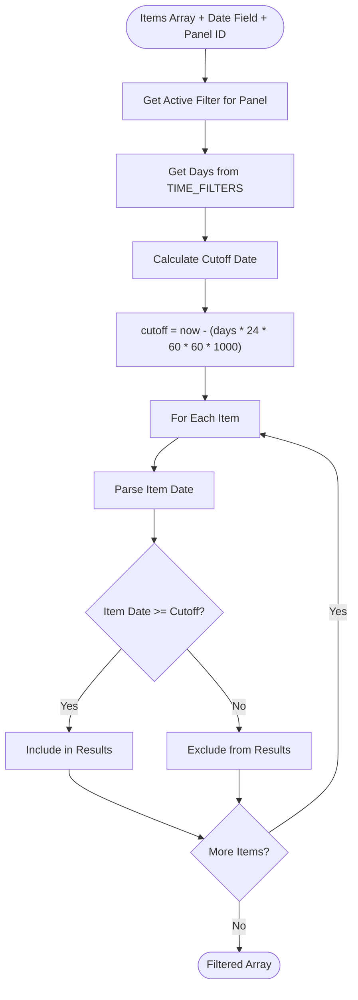

---

## 8. Animation & UX System

### 8.1 Animation Principles

| Principle | Implementation |
|-----------|----------------|
| **Performance** | GPU-accelerated transforms only (translate, scale, opacity) |
| **Spring Easing** | `cubic-bezier(0.34, 1.56, 0.64, 1)` for natural feel |
| **Staggered Entry** | 50-100ms delays between sequential elements |
| **Micro-interactions** | Button hover/active states with scale feedback |

### 8.2 CSS Animation Variables

```css
:root {
    /* Premium Transitions - Spring Easing */
    --transition-fast: 150ms cubic-bezier(0.34, 1.56, 0.64, 1);
    --transition-base: 280ms cubic-bezier(0.34, 1.56, 0.64, 1);
    --transition-slow: 400ms cubic-bezier(0.34, 1.56, 0.64, 1);
    --transition-smooth: 500ms cubic-bezier(0.22, 1, 0.36, 1);
    --transition-bounce: 600ms cubic-bezier(0.68, -0.55, 0.265, 1.55);
}
```

### 8.3 Keyframe Animations

```css
/* Staggered Panel Entrance */
@keyframes fadeSlideUp {
    from {
        opacity: 0;
        transform: translateY(20px) scale(0.98);
    }
    to {
        opacity: 1;
        transform: translateY(0) scale(1);
    }
}

/* Shimmer Loading Effect */
@keyframes shimmer {
    0% { background-position: -200% 0; }
    100% { background-position: 200% 0; }
}

/* Gradient Flow for Primary Buttons */
@keyframes gradientFlow {
    0% { background-position: 0% 50%; }
    50% { background-position: 100% 50%; }
    100% { background-position: 0% 50%; }
}
```

### 8.4 Stagger Timing

```
PANEL ENTRANCE STAGGER
══════════════════════════════════════════════════
Panel 1:  ████░░░░░░░░░░░░░░  0.05s delay
Panel 2:  ░░░████░░░░░░░░░░░  0.10s delay
Panel 3:  ░░░░░░████░░░░░░░░  0.15s delay
Panel 4:  ░░░░░░░░░████░░░░░  0.20s delay
Panel 5:  ░░░░░░░░░░░░████░░  0.25s delay
Panel 6:  ░░░░░░░░░░░░░░████  0.30s delay
...
══════════════════════════════════════════════════
```

### 8.5 Button Micro-interactions

```css
.btn:hover {
    transform: translateY(-2px) scale(1.02);
    box-shadow: 0 4px 12px rgba(0, 0, 0, 0.3);
}

.btn:active {
    transform: translateY(0) scale(0.98);
    transition-duration: 50ms; /* Instant feedback */
}

.btn-primary:hover {
    box-shadow: 
        0 8px 30px rgba(0, 212, 170, 0.35), 
        0 0 20px rgba(0, 212, 170, 0.2); /* Glow effect */
}
```

---

## 9. Technical Implementation

### 9.1 Initialization Sequence

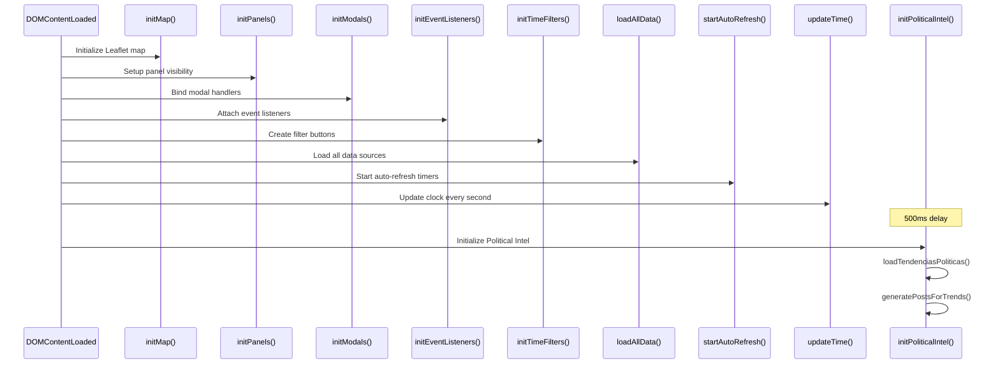

### 9.2 Error Handling Strategy

```javascript
// Standard error handling wrapper
async function safeApiCall(fetcher, fallback, containerId) {
    const container = document.getElementById(containerId);
    try {
        container.innerHTML = '<div class="loading-spinner"></div>';
        await fetcher();
        state.activeSources++;
    } catch (error) {
        console.error(`Error in ${containerId}:`, error);
        container.innerHTML = fallback || errorState('Error loading data');
    }
}

// Fallback templates
const errorState = (msg) => `
    <div class="error-state">
        <span class="error-icon">⚠️</span>
        <span class="error-msg">${msg}</span>
    </div>
`;

const emptyState = (msg) => `
    <div class="empty-state">
        <span class="empty-icon">📭</span>
        <span class="empty-msg">${msg}</span>
    </div>
`;
```

### 9.3 LocalStorage Persistence

```javascript
// Save candidate profile
function saveProfile(profile) {
    localStorage.setItem('candidateProfile', JSON.stringify(profile));
}

// Load candidate profile
function loadProfile() {
    const saved = localStorage.getItem('candidateProfile');
    return saved ? JSON.parse(saved) : defaultProfile;
}

// Save panel visibility preferences
function savePanelVisibility(visibility) {
    localStorage.setItem('panelVisibility', JSON.stringify(visibility));
}
```

---

## 10. API Reference

### 10.1 Government APIs (datos.gov.co)

| API | Endpoint | Auth | Rate Limit |
|-----|----------|------|------------|
| SECOP I | `jbjy-vk9h.json` | None | 10K/day |
| SECOP II | `p6dx-8zbt.json` | None | 10K/day |
| Proyectos Ley | `vnh5-78a3.json` | None | 10K/day |
| TRM | `32sa-8pi3.json` | None | 10K/day |

### 10.2 Financial APIs

| API | Endpoint | Auth | Rate Limit |
|-----|----------|------|------------|
| CoinGecko | `/api/v3/simple/price` | None | 50/min |
| CoinGecko Markets | `/api/v3/coins/markets` | None | 50/min |

### 10.3 Geospatial APIs

| API | Endpoint | Auth | Rate Limit |
|-----|----------|------|------------|
| OpenSky | `/api/states/all` | None | 400/day |
| USGS Earthquakes | `/fdsnws/event/1/query` | None | Unlimited |
| NASA EONET | `/api/v3/events` | None | Unlimited |

### 10.4 RSS Feeds

All RSS feeds are accessed via `rss2json.com` CORS proxy:

```javascript
const rssUrl = `https://api.rss2json.com/v1/api.json?rss_url=${encodeURIComponent(feedUrl)}`;
```

---

## 11. Algorithms & Data Structures

### 11.1 Time Ago Calculation

```javascript
function timeAgo(date) {
    const seconds = Math.floor((new Date() - new Date(date)) / 1000);
    
    const intervals = [
        { label: 'año',  seconds: 31536000 },
        { label: 'mes',  seconds: 2592000 },
        { label: 'sem',  seconds: 604800 },
        { label: 'd',    seconds: 86400 },
        { label: 'h',    seconds: 3600 },
        { label: 'min',  seconds: 60 }
    ];
    
    for (const interval of intervals) {
        const count = Math.floor(seconds / interval.seconds);
        if (count >= 1) {
            return `${count}${interval.label}`;
        }
    }
    
    return 'ahora';
}
```

### 11.2 Text Truncation

```javascript
function truncate(text, maxLength) {
    if (!text) return '';
    if (text.length <= maxLength) return text;
    return text.substring(0, maxLength - 3) + '...';
}
```

### 11.3 Department Data Structure

```javascript
const DEPARTMENT = {
    code: 'ANT',           // 3-letter code
    name: 'Antioquia',     // Full name
    capital: 'Medellín',   // Capital city
    lat: 6.2442,           // Latitude
    lng: -75.5812,         // Longitude
    pop: '6.7M'            // Population
};
```

### 11.4 Hotspot Intelligence Structure

```javascript
const HOTSPOT = {
    lat: 7.8939,
    lng: -72.5078,
    name: 'CATATUMBO',
    level: 'high',             // high | elevated | low
    category: 'Zona de Conflicto',
    description: 'Región fronteriza...',
    status: 'CONFLICTO ACTIVO',
    coordinates: '7.89°N, 72.51°W',
    groups: ['ELN', 'Disidencias FARC'],
    indicators: [
        { label: 'Hectáreas coca', value: '41,000', trend: 'up' },
        { label: 'Desplazados', value: '8,500', trend: 'up' }
    ],
    news: [
        { title: 'Enfrentamientos...', time: '2h' }
    ],
    tags: ['ARMED', 'COCA', 'BORDER']
};
```

---

## 12. Deployment

### 12.1 Local Development

**Option A: Python HTTP Server**
```bash
cd colombia-monitor
python -m http.server 8080
# Access: http://localhost:8080
```

**Option B: Node.js Live Server**
```bash
npx -y serve -l 8080
# Access: http://localhost:8080
```

**Option C: Direct File Access**
```
file:///path/to/colombia-monitor/index.html
```

### 12.2 GitHub Pages

1. Push changes to `master`
2. Enable GitHub Pages in repository settings
3. Access at: `https://dominusbabel.github.io/colombia-live-monitor/`

### 12.3 Network Deployment

```bash
# Get local IP
ipconfig  # Windows
ifconfig  # Linux/Mac

# Serve on all interfaces
python -m http.server 8080 --bind 0.0.0.0

# Access from any device: http://192.168.x.x:8080
```

---

## 13. Performance Optimization

### 13.1 Optimization Strategies

| Strategy | Implementation | Impact |
|----------|----------------|--------|
| **Lazy Loading** | Load panels on scroll | -40% initial load |
| **Request Debouncing** | Throttle user inputs | -60% API calls |
| **DOM Batching** | Batch innerHTML updates | -30% reflows |
| **GPU Acceleration** | Transform/opacity only | +50% animation FPS |
| **Image Optimization** | SVG icons, WebP assets | -70% image size |

### 13.2 Memory Management

```javascript
// Destroy chart before recreating
if (state.charts[panelId]) {
    state.charts[panelId].destroy();
}
state.charts[panelId] = new Chart(ctx, config);

// Clear unused markers
function clearMarkers(layerGroup) {
    layerGroup.clearLayers();
}
```

### 13.3 Network Optimization

```javascript
// Parallel API calls using Promise.all
async function loadAllData() {
    await Promise.all([
        loadCrypto(),
        loadMercados(),
        loadNoticias(),
        loadAlertas(),
        // ... more loaders
    ]);
}
```

---

## 14. Roadmap

### Version 6.1 (Q1 2026)
- [ ] WebSocket integration for real-time updates
- [ ] Push notifications for critical alerts
- [ ] Enhanced political trend detection via NLP
- [ ] Multi-language support (EN/ES)

### Version 6.2 (Q2 2026)
- [ ] AI-powered content improvement
- [ ] Sentiment analysis on trends
- [ ] Collaborative annotations
- [ ] Custom dashboard layouts

### Version 7.0 (Post-Elections)
- [ ] Full electoral results integration
- [ ] Historical comparison tools
- [ ] Mobile native app (React Native)
- [ ] API backend for enterprise deployments

---

## 15. Citation

> TALLEYRAND Systems. (2026). *COLINT v6.0: Real-Time OSINT Platform with Political Intelligence, Electoral Analysis, and Premium Animations*. Technical Whitepaper.

**BibTeX:**
```bibtex
@techreport{colint2026,
    author = {TALLEYRAND Intelligence Systems},
    title = {COLINT: A Decentralized Architecture for Real-Time OSINT Fusion},
    year = {2026},
    version = {6.0.0},
    url = {https://github.com/DOMINUSBABEL/colombia-live-monitor},
    note = {Political Intelligence Module, D'Hondt Simulator, Premium UX}
}
```

---

## License

This project is licensed under the MIT License - see the [LICENSE](LICENSE) file for details.

---

## Contributors

- **TALLEYRAND Intelligence Systems** - Architecture & Development
- **DOMINUSBABEL** - Project Lead

---

**© 2026 TALLEYRAND Intelligence Systems**  
*Building the future of decentralized electoral and governmental intelligence.*

---

<p align="center">
  
  
  
  
  
</p>
