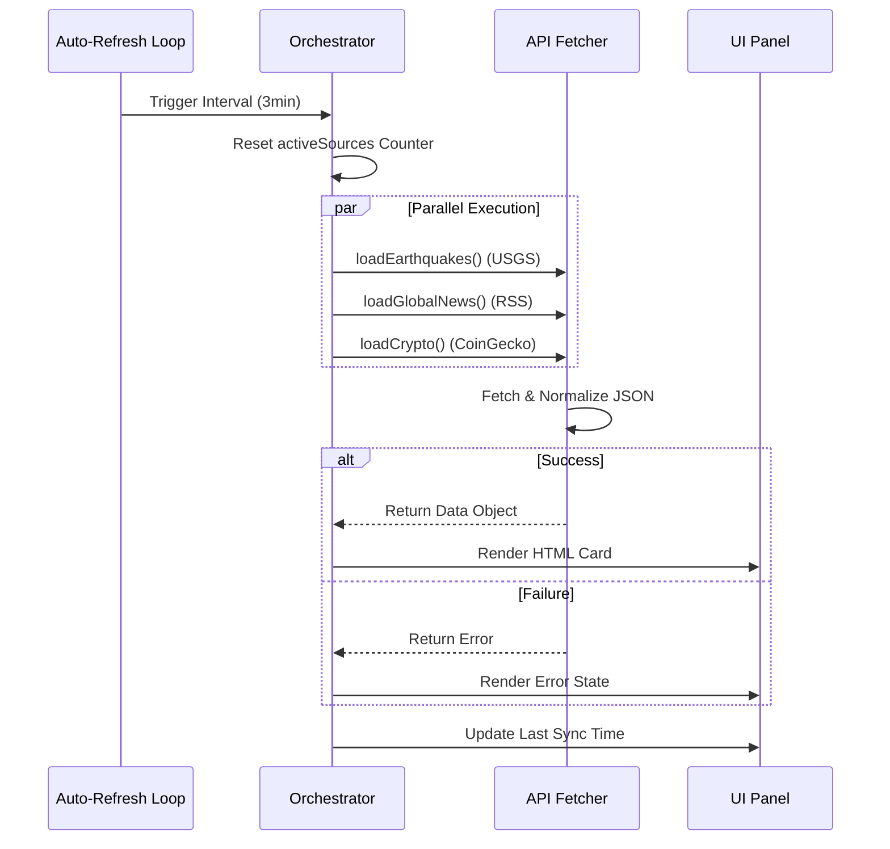

# COLINT: A Decentralized Architecture for Real-Time Open Source Intelligence (OSINT) Fusion

**Authors:** TALLEYRAND Intelligence Systems  
**Date:** January 2026  
**Version:** 2.1.0 (Deep-State Release)  
**Repository:** [github.com/DOMINUSBABEL/colombia-live-monitor](https://github.com/DOMINUSBABEL/colombia-live-monitor)  
**License:** MIT  

[](https://github.com/DOMINUSBABEL)
[](https://github.com/DOMINUSBABEL)
[](https://github.com/DOMINUSBABEL)

---

## Abstract

This technical blueprint presents the architectural specification for **COLINT (Colombia Intelligence Monitor)**, a browser-based, high-performance OSINT visualization platform. Unlike traditional intelligence dashboards that rely on heavy backend orchestration, COLINT implements a **Client-Side Data Fusion (CSDF)** model. This approach delegates data acquisition, normalization, and rendering to the client, enabling deployment in server-less environments (static edge/CDN). The system fuses **35+ real-time vectors**—including satellite telemetry, fiscal transparency streams, and geopolitical RSS feeds—into a coherent situational awareness picture. This document details the system's internal logic, data pipelines, and component interactivity through formal diagrams.

---

## 1. System Architecture

### 1.1 High-Level Design Pattern
COLINT utilizes a **Modular Monolithic Logic** pattern within a Single Page Application (SPA) structure. The core `app.js` acts as the central orchestrator, managing state (`State Store`) and dispatching update events to independent UI components (`Panels`).

```mermaid
graph TD
    subgraph "External Ecosystem"
        S1[Govt APIs (SECOP/DANE)]
        S2[Geo APIs (USGS/OpenSky)]
        S3[Media Feeds (RSS/JSON)]
        S4[Financial APIs (CoinGecko)]
    end

    subgraph "COLINT Client Core"
        Orchestrator[State Orchestrator (app.js)]
        Normalizer[Data Normalization Layer]
        State[State Store (Memory)]
        
        S1 & S2 & S3 & S4 -->|Async Fetch| Normalizer
        Normalizer -->|Cleaned Data| State
        Orchestrator -->|Dispatch| State
    end

    subgraph "Visualisation Layer"
        Map[Leaflet Interactive Map]
        Grid[CSS Grid Dashboard]
        
        State -->|Render Event| Map
        State -->|Render Event| Grid
    end
```

### 1.2 The "Zero-Backend" Philosophy
By eliminating the middleware server, COLINT achieves:
1.  **Uncensorability:** Code can run locally from a USB drive or via IPFS.
2.  **Privacy:** No central server logging user queries; all requests originating from the client IP.
3.  **Scalability:** Dependent only on client hardware and external API rate limits.

---

## 2. Functional Specification & Data Pipelines

### 2.1 Data Ingestion Pipeline (`loadAllData`)
The data ingestion process is non-blocking and concurrent. It uses `Promise.allSettled` to ensure that a failure in one vector (e.g., Twitter API) does not crash the dashboard.



### 2.2 Geo-Spatial Rendering Logic (`initMap` & `addHotspots`)
The map is the central intelligence artifact. It overlays multiple distinct datasets onto a dark-mode cartographic base.

#### Flowchart: Layer Construction
```mermaid
flowchart LR
    Start[Init Map] --> BaseLayer[Load CartoDB Dark Tiles]
    BaseLayer --> Bounds[Set Limits: Colombia/Global]
    
    Bounds --> L1[Layer: Conflicts]
    Bounds --> L2[Layer: Flights (ADS-B)]
    Bounds --> L3[Layer: Mining/Crops]
    
    L1 --> Hotspots[Render Hotspots]
    Hotspots --> Popup[Bind Rich HTML Popups]
    
    L2 --> Rotation[Calc Plane Heading]
    Rotation --> Marker[Render Rotated Icon]
    
    L3 --> Polygons[Draw GeoJSON Shapes]
    
    End[Map Ready]
```

#### Detailed Popup Structure (`injectPopupStyles`)
The `addHotspots` function dynamically generates complex HTML for popups. This is not just text; it's a micro-application within the map bubble.
*   **Header:** Warning Level (Low/High/Critical).
*   **Categorization:** Tags (Narcotrafficking, Border Security).
*   **Metrics Grid:** Flexbox layout showing quantitative data (Hectares, Troops).
*   **News Feed:** Embedded filtered headlines related to that specific coordinate.

---

## 3. Module Blueprints

### 3.1 Global & Strategic Intelligence Module
This module monitors external stability factors.
*   **Function:** `loadGlobalAmericas()`, `loadGeopolitics()`
*   **Source:** RSS Feeds (BBC, Reuters, Crisis Group) -> `rss2json.com` proxy.
*   **Logic:**
    1.  Request RSS XML via Proxy.
    2.  Parse JSON response.
    3.  Filter items > 24 hours old (optional).
    4.  Extract metadata (pubDate, source, link).
    5.  Render standardized news card.

### 3.2 Fiscal Transparency Module (SECOP)
Monitor of government spending.
*   **Function:** `loadSecop()`
*   **Source:** Socrata API (`datos.gov.co`).
*   **Query Logic:**
    *   `$limit`: 10 items.
    *   `$order`: `fecha_de_firma DESC`.
    *   `$where`: `quantia > 10000000` (Filter petty cash).

### 3.3 Environmental Risk Module
*   **Function:** `loadEarthquakes()`
*   **Source:** USGS Earthquake Hazards Program.
*   **Filtering:** Only magnitude > 4.5.
*   **Visual Coding:**
    *   `Mag > 6.0`: Red Border (Critical).
    *   `Mag > 5.0`: Orange Border (Warning).
    *   `Mag < 5.0`: Green Border (Info).

---

## 4. Operational Protocols

### 4.1 Refresh Cycles
To prevent API rate limiting, the system uses a tiered refresh strategy:

| Tier | Interval | Modules | Justification |
|------|----------|---------|---------------|
| **Tier 1 (Fast)** | 30 sec | Crypto, Flights | Highly volatile, real-time necessity. |
| **Tier 2 (Tactical)** | 3 min | News, Alerts, Earthquakes | Updated frequently, but static for minutes. |
| **Tier 3 (Strategic)** | 5 min | SECOP, Fiscal, Reports | Slow-moving bureaucratic data. |

### 4.2 Error Handling & Resilience
*   **Graceful Degradation:** If `rss2json` fails, the panel shows a "Connection Error" state without blocking other JS execution.
*   **Skeleton Loading:** CSS animations provide visual feedback (`.loading-spinner`) during async fetch operations.

---

## 5. Deployment Guide

### 5.1 Local Execution
Ideal for air-gapped or secure analysis stations.
1.  Verify file integrity: `index.html`, `app.js`, `styles.css`.
2.  Launch wrapper:
    ```bash
    # Python 3
    python -m http.server 8000
    ```
3.  Access via local loopback: `http://localhost:8000`.

### 5.2 Network Deployment (GitHub Pages)
1.  Fork repository.
2.  Enable GitHub Pages from `/docs` or root.
3.  System auto-deploys via GitHub Actions (if configured) or static serving.

---

## 6. Academic & Legal

### 6.1 Citation
If utilizing this architecture for research, please cite:
> TALLEYRAND Systems. (2026). *COLINT: A Decentralized Architecture for Real-Time OSINT Fusion*. arXiv preprint.

### 6.2 Data Rights
This software aggregates public data. All rights to the underlying data belong to their respective providers (Government of Colombia, US Geological Survey, NASA, etc.).

---

**© 2026 TALLEYRAND Intelligence Systems**  
*Building the future of decentralized intelligence.*
