# COLINT: A Decentralized Architecture for Real-Time Open Source Intelligence (OSINT) Fusion

**Authors:** TALLEYRAND Intelligence Systems  
**Date:** January 2026  
**Version:** 5.0.0 (Elections + SECOP II + Time Filters Edition)  
**Repository:** [github.com/DOMINUSBABEL/colombia-live-monitor](https://github.com/DOMINUSBABEL/colombia-live-monitor)  
**License:** MIT  

[](https://github.com/DOMINUSBABEL)
[](https://github.com/DOMINUSBABEL)
[](https://github.com/DOMINUSBABEL)
[](https://www.chartjs.org/)
[](https://github.com/DOMINUSBABEL)
[](https://github.com/DOMINUSBABEL)

---

## Abstract

This technical blueprint presents the architectural specification for **COLINT (Colombia Intelligence Monitor)**, a browser-based, high-performance OSINT visualization platform engineered for national-level situational awareness. Version 5.0 represents a major evolution with the integration of **SECOP II procurement data**, **real Colombian legislative feeds**, **dynamic time filtering** (24H/7D/30D/ALL), and an enhanced **D'Hondt electoral simulator** with historical E-14/E-24 form data.

The system now orchestrates **45+ real-time data vectors** through a sophisticated multi-tier refresh architecture, fusing electoral RSS feeds, government procurement APIs, congressional activity, environmental monitoring, financial markets, cryptocurrency prices, and geopolitical intelligence into a unified command dashboard. The platform features a fully interactive **Leaflet-based map** with 32 Colombian departments, conflict zones, mining operations, protest hotspots, and live flight tracking.

---

## Table of Contents

1. [System Architecture](#1-system-architecture)
2. [Data Pipelines](#2-data-pipelines)
3. [Module Blueprints](#3-module-blueprints)
4. [Elections 2026 Deep Dive](#4-elections-2026-deep-dive)
5. [Government Intelligence Module](#5-government-intelligence-module)
6. [Time Filtering System](#6-time-filtering-system)
7. [Technical Implementation](#7-technical-implementation)
8. [API Reference](#8-api-reference)
9. [Deployment](#9-deployment)
10. [Roadmap](#10-roadmap)
11. [Citation](#11-citation)

---

## 1. System Architecture

### 1.1 High-Level Design Pattern

COLINT employs an **event-driven microservice architecture** adapted for browser execution. The system decouples data ingestion from visualization through an orchestration layer that manages asynchronous API calls, state updates, and render cycles.


### 1.2 Core Design Principles

| Principle | Implementation |
|-----------|----------------|
| **Zero Backend** | Pure client-side JavaScript with CORS proxy for RSS feeds |
| **Graceful Degradation** | Fallback mock data when APIs are unavailable |
| **Tiered Refresh** | Different update intervals based on data volatility |
| **Mobile-First** | Responsive CSS Grid with touch-optimized controls |
| **Offline Capable** | Static electoral data works without network |

### 1.3 Technology Stack


### 1.4 New in v5.0

- **SECOP II Integration** - Real-time government procurement from Colombiacompra with contract values
- **Time Filtering** - Dynamic date range filters (24H/7D/30D/ALL) on 6 key panels
- **Legislative API** - Real congressional bills from Congreso Visible
- **D'Hondt Simulator** - Interactive seat allocation calculator for electoral scenarios
- **Historical E-14/E-24 Data** - 10 years of electoral form data integrated
- **Differentiated Refresh Rates** - Optimized API polling per data type
- **Enhanced Conflict Tracking** - Real-time conflict news via Google News RSS

---

## 2. Data Pipelines

### 2.1 Data Ingestion Pipeline

The orchestrator (`loadAllData()`) manages 30+ parallel API calls with error handling and retry logic. Each data source has its own loader function that normalizes responses into a common format.


### 2.2 Complete Data Source Matrix

| Category | Module | Source API | Update Frequency | Filterable |
|----------|--------|------------|------------------|------------|
| **Electoral** | Presidential Polls | Invamer/Guarumo/CNC | 3 min | ❌ |
| **Electoral** | Electoral News | Google News RSS | 3 min | ❌ |
| **Electoral** | Congress Composition | Registraduría | Static | ❌ |
| **Electoral** | Voter Turnout | Historical Data | Static | ❌ |
| **Electoral** | D'Hondt Simulator | User Input | On Demand | ❌ |
| **Electoral** | E-14/E-24 History | CSV Files | Static | ❌ |
| **Electoral** | Countdown | Real-time JS | 1 sec | ❌ |
| **Government** | SECOP I | datos.gov.co | 5 min | ✅ |
| **Government** | SECOP II | datos.gov.co | 5 min | ✅ |
| **Government** | Congreso Visible | API REST | 10 min | ✅ |
| **Government** | Cuentas Claras | Mock | Static | ❌ |
| **Government** | Regalías | Mock | Static | ❌ |
| **Government** | Contraloría | Mock | Static | ❌ |
| **Financial** | Cryptocurrency | CoinGecko | 30 sec | ❌ |
| **Financial** | TRM Colombia | API TRM | 5 min | ❌ |
| **Financial** | BVC COLCAP | Mock | 5 min | ❌ |
| **Financial** | Commodities | Mock | 5 min | ❌ |
| **News** | Colombia News | El Tiempo/Semana RSS | 3 min | ✅ |
| **News** | Americas | BBC Latin America | 3 min | ❌ |
| **News** | Europe | BBC Europe | 3 min | ❌ |
| **News** | Asia | Al Jazeera | 3 min | ❌ |
| **News** | Geopolitics | Crisis Group | 10 min | ❌ |
| **Security** | Alerts | UNGRD | 3 min | ✅ |
| **Security** | Emergencies | UNGRD | 3 min | ✅ |
| **Security** | Conflicts | Google News | 3 min | ✅ |
| **Environment** | Earthquakes | USGS | 3 min | ❌ |
| **Environment** | Wildfires | NASA EONET | 10 min | ❌ |
| **Environment** | Weather | OpenMeteo | 10 min | ❌ |
| **Transport** | Flights | OpenSky Network | 45 sec | ❌ |
| **Sports** | Colombia Sports | ESPN RSS | 5 min | ❌ |
| **Sports** | International | ESPN RSS | 5 min | ❌ |
| **Tech** | Tech News | Wired/Ars Technica | 5 min | ❌ |
| **Tech** | Cybersecurity | The Hacker News | 5 min | ❌ |

### 2.3 CORS Proxy Configuration

RSS feeds require a CORS proxy for browser access. The system uses `api.allorigins.win` as the primary proxy:

```javascript
const CORS_PROXY = 'https://api.allorigins.win/raw?url=';

async function fetchRSS(url, source) {
    const response = await fetch(CORS_PROXY + encodeURIComponent(url));
    const text = await response.text();
    const parser = new DOMParser();
    return parser.parseFromString(text, 'text/xml');
}
```

---

## 3. Module Blueprints

### 3.1 Panel Architecture

Each panel follows a standardized structure with loading states, error handling, and time filter support:

```mermaid
flowchart TD
    subgraph Panel["Panel Component"]
        Header[Panel Header + Icon]
        Filter[Time Filter Buttons]
        Content[Scrollable Content Area]
        Footer[Source Attribution]
    end
    
    subgraph States["Panel States"]
        Loading[⏳ Loading...]
        Data[📊 Data Rendered]
        Error[❌ Error State]
        Empty[∅ No Data]
    end
    
    Header --> Filter
    Filter --> Content
    Content --> Footer
    Content --> States
```



### 3.2 Global Intelligence Module

The global intelligence module provides worldwide situational awareness through curated RSS feeds:

| Region | Source | Feed URL | Topics |
|--------|--------|----------|--------|
| **Americas** | BBC Latin America | `/mundo.xml` | Politics, Economy, Security |
| **Europe** | BBC Europe | `/europe.xml` | EU, NATO, Eastern Europe |
| **Asia-Pacific** | Al Jazeera | `/asia.xml` | China, India, ASEAN |
| **Geopolitics** | Crisis Group | `/feed/` | Conflicts, Diplomacy |
| **Tech** | Wired | `/feed/` | Innovation, AI, Space |
| **Cyber** | The Hacker News | `/feed/` | Vulnerabilities, Attacks |

### 3.3 Environmental Risk Module

Real-time environmental monitoring from authoritative sources:

```mermaid
flowchart LR
    subgraph Inputs
        USGS[USGS Earthquake API]
        NASA[NASA EONET/FIRMS]
        OM[OpenMeteo]
    end
    
    subgraph Processing
        Filter[Magnitude Filter ≥4.5]
        Geo[GeoJSON Parser]
        Weather[Weather Decoder]
    end
    
    subgraph Outputs
        EQ[🌋 Earthquake Panel]
        Fire[🔥 Wildfire Panel]
        Climate[🌦️ Weather Panel]
        MapLayer[Map Markers]
    end
    
    USGS --> Filter --> EQ
    USGS --> Geo --> MapLayer
    NASA --> Geo --> Fire
    NASA --> Geo --> MapLayer
    OM --> Weather --> Climate
```



### 3.4 Financial Module

Multi-source financial intelligence covering crypto, forex, and local markets:

- **Cryptocurrency**: BTC, ETH, SOL, AVAX, BONK, ADA via CoinGecko API
- **Colombian Markets**: TRM (USD/COP), BVC COLCAP Index
- **Commodities**: Oil (WTI/Brent), Gold, Coffee (Arabica)

---

## 4. Elections 2026 Deep Dive

### 4.1 Electoral Module Architecture

The Elections 2026 module is the flagship feature of COLINT v4.0+, providing comprehensive electoral intelligence:

```mermaid
flowchart TD
    subgraph Electoral["Elections 2026 Module"]
        Countdown[🕐 Countdown Timer<br/>May 31, 2026]
        Polls[📊 Presidential Polls<br/>Bar Chart]
        Senate[🏛️ Senado Composition<br/>Doughnut 108 seats]
        Chamber[🏛️ Cámara Composition<br/>Doughnut 188 seats]
        Turnout[📈 Historical Turnout<br/>Line Chart 2006-2022]
        Finance[💰 Campaign Financing<br/>Bar Chart]
        News[📰 Electoral News<br/>Google News RSS]
        DHondt[🧮 D'Hondt Simulator<br/>Interactive Calculator]
        Historic[📋 E-14/E-24 Data<br/>Historical Forms]
        Parties[🎨 Party Strength<br/>Polar Area Chart]
    end
    
    Countdown --> Polls
    Polls --> Senate
    Senate --> Chamber
    Chamber --> Turnout
    Turnout --> Finance
    Finance --> News
    News --> DHondt
    DHondt --> Historic
    Historic --> Parties
```



### 4.2 Presidential Polls Panel

Real polling data from major Colombian pollsters:

```javascript
const POLL_DATA = [
    { candidate: 'Sergio Fajardo', party: 'Centro Esperanza', pct: 23.5/*, color... */ },
    { candidate: 'Gustavo Petro', party: 'Pacto Histórico', pct: 31.2 },
    { candidate: 'Federico Gutiérrez', party: 'Equipo por Colombia', pct: 18.7 },
    { candidate: 'Rodolfo Hernández', party: 'Liga de Gobernantes', pct: 12.3 },
    // ... more candidates
];
```

### 4.3 D'Hondt Electoral Simulator

Interactive seat allocation calculator based on the D'Hondt method used in Colombian legislative elections:

```javascript
function calculateDhondt(parties, totalSeats) {
    const results = parties.map(p => ({ ...p, seats: 0, quotients: [] }));
    
    // Generate quotients
    for (let party of results) {
        for (let d = 1; d <= totalSeats; d++) {
            party.quotients.push({ value: party.votes / d, partyIndex: results.indexOf(party) });
        }
    }
    
    // Flatten and sort all quotients
    const allQuotients = results.flatMap(p => p.quotients);
    allQuotients.sort((a, b) => b.value - a.value);
    
    // Allocate seats to top quotients
    for (let i = 0; i < totalSeats; i++) {
        results[allQuotients[i].partyIndex].seats++;
    }
    
    return results;
}
```

### 4.4 Historical Electoral Data (E-14/E-24 Forms)

Integration of historical voting data from official E-14 and E-24 forms:

| Year | Election Type | Total Votes | Turnout | Data Source |
|------|---------------|-------------|---------|-------------|
| 2022 | Presidential | 21.8M | 54.9% | Registraduría |
| 2018 | Presidential | 19.6M | 53.4% | Registraduría |
| 2014 | Presidential | 15.8M | 47.9% | Registraduría |
| 2010 | Presidential | 14.8M | 49.3% | Registraduría |
| 2006 | Presidential | 12.0M | 45.1% | Registraduría |

### 4.5 Congress Composition

Real-time visualization of the current Colombian Congress:

**Senado (108 seats):**
- Pacto Histórico: 28 seats
- Partido Conservador: 16 seats
- Partido Liberal: 15 seats
- Centro Democrático: 14 seats
- Cambio Radical: 11 seats
- Others: 24 seats

**Cámara de Representantes (188 seats):**
- Pacto Histórico: 32 seats
- Partido Liberal: 33 seats
- Partido Conservador: 25 seats
- Centro Democrático: 16 seats
- Cambio Radical: 15 seats
- Others: 67 seats

---

## 5. Government Intelligence Module

### 5.1 SECOP Integration (I + II)

COLINT integrates both SECOP I and SECOP II for comprehensive government procurement monitoring:


**SECOP Data Fields:**
- `nombre_de_la_entidad` - Contracting entity
- `descripci_n_del_procedimiento` - Contract description
- `valor_del_contrato` - Contract value (COP)
- `fecha_de_inicio_del_contrato` - Start date
- `estado_contrato` - Contract status

### 5.2 Congressional Activity (Congreso Visible)

Real-time legislative tracking from Congreso Visible API:

```javascript
const LEGISLATIVE_API = 'https://congresovisible.uniandes.edu.co/api/';

async function loadCongreso() {
    const [projects, votes] = await Promise.all([
        fetch(LEGISLATIVE_API + 'proyectos/?format=json'),
        fetch(LEGISLATIVE_API + 'votaciones/?format=json')
    ]);
    // Process and render...
}
```

**Tracked Legislative Data:**
- Active bill proposals
- Committee assignments
- Voting records
- Congressional debates

### 5.3 Electoral Financing (Cuentas Claras)

Campaign finance monitoring from CNE's Cuentas Claras system:

| Party | 2022 Funding (COP) | % of Total |
|-------|-------------------|------------|
| Pacto Histórico | $45.2B | 28% |
| Equipo Colombia | $38.7B | 24% |
| Centro Democrático | $31.5B | 20% |
| Partido Liberal | $22.1B | 14% |
| Others | $22.5B | 14% |

---

## 6. Time Filtering System

### 6.1 Filter Architecture

Version 5.0 introduces a powerful time filtering system for data-heavy panels:


### 6.2 Filter Implementation

```javascript
const TIME_FILTERS = {
    '24h': { label: '24H', days: 1 },
    '7d':  { label: '7D',  days: 7 },
    '30d': { label: '30D', days: 30 },
    'all': { label: 'TODO', days: 365 }
};

const FILTERABLE_PANELS = ['secop', 'congreso', 'noticias', 'alertas', 'emergencias', 'conflictos'];

function filterByDate(items, dateField, panelId) {
    const days = getFilterDays(panelId);
    if (days >= 365) return items; // Return all
    
    const cutoff = new Date();
    cutoff.setDate(cutoff.getDate() - days);
    
    return items.filter(item => new Date(item[dateField]) >= cutoff);
}
```

### 6.3 User Interface

Each filterable panel includes a filter control bar:

```html
<div class="panel-time-filter" data-panel="secop">
    <button class="filter-btn" data-filter="24h">24H</button>
    <button class="filter-btn active" data-filter="7d">7D</button>
    <button class="filter-btn" data-filter="30d">30D</button>
    <button class="filter-btn" data-filter="all">TODO</button>
</div>
```

---

## 7. Technical Implementation

### 7.1 Chart.js Integration

All charts use Chart.js 4.x with custom dark theme styling:

```javascript
const darkTheme = {
    color: '#e0e0e0',
    backgroundColor: 'rgba(0, 212, 170, 0.8)',
    borderColor: '#00d4aa',
    gridColor: 'rgba(255, 255, 255, 0.1)',
    tooltipBackground: 'rgba(26, 32, 44, 0.95)'
};

new Chart(ctx, {
    type: 'bar',
    data: { 
        labels: candidates.map(c => c.name), 
        datasets: [{
            data: candidates.map(c => c.percentage),
            backgroundColor: candidates.map(c => c.partyColor),
            borderRadius: 4
        }] 
    },
    options: {
        indexAxis: 'y',
        responsive: true,
        maintainAspectRatio: false,
        plugins: { 
            legend: { display: false },
            tooltip: {
                backgroundColor: darkTheme.tooltipBackground,
                titleColor: '#fff',
                bodyColor: '#ccc'
            }
        },
        scales: {
            x: { grid: { color: darkTheme.gridColor } },
            y: { grid: { display: false } }
        }
    }
});
```

### 7.2 Leaflet Map Configuration

Interactive map with multiple layers and department markers:

```javascript
const mapConfig = {
    center: [4.5709, -74.2973], // Colombia center
    zoom: 6,
    minZoom: 5,
    maxZoom: 18,
    zoomControl: true
};

const layers = {
    conflicts: L.layerGroup(),
    mining: L.layerGroup(),
    crops: L.layerGroup(),
    protests: L.layerGroup(),
    contracts: L.layerGroup(),
    flights: L.layerGroup()
};
```

### 7.3 Differentiated Refresh Strategy

Optimized API polling based on data volatility and rate limits:

| Tier | Interval | Modules | Rationale |
|------|----------|---------|-----------|
| **Ultra-Fast** | 30 sec | Crypto, Flights | High volatility, real-time value |
| **Fast** | 1 min | Alerts, Emergencies | Security-critical |
| **Tactical** | 3 min | News, Polls, Conflicts | Moderate update frequency |
| **Standard** | 5 min | SECOP, Markets, Sports | Rate limit compliance |
| **Slow** | 10 min | Congress, Weather, Fires | Low volatility data |
| **Static** | On Load | Elections, Turnout, History | Historical/reference data |

### 7.4 State Management

Centralized state store for application-wide data management:

```javascript
const state = {
    map: null,
    layers: {},
    markers: [],
    customMonitors: [],
    panelVisibility: {},
    refreshTimers: {},
    activeSources: 0,
    charts: {},
    filters: {
        secop: '7d',
        congreso: '7d',
        noticias: '7d',
        alertas: '7d',
        emergencias: '7d',
        conflictos: '7d'
    }
};
```

---

## 8. API Reference

### 8.1 Government APIs

| API | Endpoint | Rate Limit | Auth |
|-----|----------|------------|------|
| SECOP I | `datos.gov.co/resource/jbjy-vk9h.json` | 1000/day | None |
| SECOP II | `datos.gov.co/resource/p6dx-8zbt.json` | 1000/day | None |
| TRM | `trm-colombia.vercel.app/api` | Unlimited | None |
| Congreso Visible | `congresovisible.uniandes.edu.co/api/` | Varies | API Key |

### 8.2 Environmental APIs

| API | Endpoint | Parameters | Auth |
|-----|----------|------------|------|
| USGS Earthquakes | `earthquake.usgs.gov/fdsnws/event/1/query` | `format=geojson&minmagnitude=4.5` | None |
| NASA FIRMS | `firms.modaps.eosdis.nasa.gov/api/country/csv/` | `COL/1` | API Key |
| OpenMeteo | `api.open-meteo.com/v1/forecast` | `latitude&longitude&current_weather` | None |

### 8.3 Financial APIs

| API | Endpoint | Rate Limit | Auth |
|-----|----------|------------|------|
| CoinGecko | `api.coingecko.com/api/v3/simple/price` | 50/min | None |
| OpenSky | `opensky-network.org/api/states/all` | 100/day | None (basic) |

---

## 9. Deployment

### 9.1 Local Development

**Option A: Python HTTP Server**
```bash
cd colombia-monitor
python -m http.server 8080
# Access: http://localhost:8080
```

**Option B: Node.js Live Server**
```bash
npx -y serve -l 8080
# Access: http://localhost:8080
```

**Option C: Direct File Access**
```
file:///path/to/colombia-monitor/index.html
```

### 9.2 GitHub Pages

The repository is configured for automatic deployment from the `master` branch:

1. Push changes to `master`
2. GitHub Actions builds and deploys
3. Access at: `https://dominusbabel.github.io/colombia-live-monitor/`

### 9.3 Network Deployment

For LAN access (useful for team collaboration):

```bash
# Get local IP
ipconfig  # Windows
ifconfig  # Linux/Mac

# Serve on all interfaces
python -m http.server 8080 --bind 0.0.0.0

# Access from any device on network:
# http://192.168.x.x:8080
```

### 9.4 Production Checklist

- [ ] Replace mock API keys with production keys
- [ ] Configure CORS proxy for production domain
- [ ] Enable service worker for offline support
- [ ] Minify JavaScript and CSS
- [ ] Add error monitoring (Sentry, etc.)
- [ ] Configure CDN for static assets

---

## 10. Roadmap

### Version 5.1 (Q1 2026)
- [ ] WebSocket integration for real-time updates
- [ ] Push notifications for critical alerts
- [ ] Export functionality (PDF/Excel)
- [ ] User preferences persistence (localStorage)

### Version 5.2 (Q2 2026)
- [ ] AI-powered trend analysis
- [ ] Natural language search
- [ ] Collaborative annotations
- [ ] Custom dashboard layouts

### Version 6.0 (Post-Elections)
- [ ] Full electoral results integration
- [ ] Historical comparison tools
- [ ] Regional drill-down analytics
- [ ] Mobile native app (React Native)

---

## 11. Citation

> TALLEYRAND Systems. (2026). *COLINT v5.0: Real-Time OSINT Platform with Electoral Intelligence, SECOP II Integration, and Dynamic Time Filtering*. Technical Whitepaper.

**BibTeX:**
```bibtex
@techreport{colint2026,
    author = {TALLEYRAND Intelligence Systems},
    title = {COLINT: A Decentralized Architecture for Real-Time OSINT Fusion},
    year = {2026},
    version = {5.0.0},
    url = {https://github.com/DOMINUSBABEL/colombia-live-monitor}
}
```

---

## License

This project is licensed under the MIT License - see the [LICENSE](LICENSE) file for details.

---

## Contributors

- **TALLEYRAND Intelligence Systems** - Architecture & Development
- **DOMINUSBABEL** - Project Lead

---

**© 2026 TALLEYRAND Intelligence Systems**  
*Building the future of decentralized electoral and governmental intelligence.*

---

<p align="center">
  
  
  
</p>
